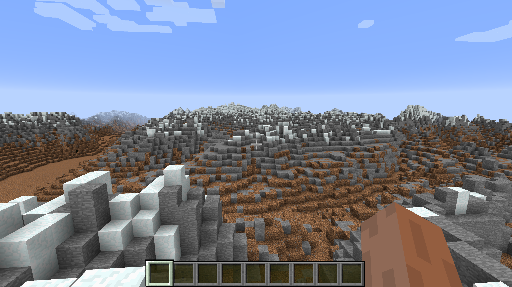

Minecraft Height Model Plugin
=============================

This is a plugin for the Bukkit Minecraft Mod and allows you to generate
a terrain in Minecraft from a height model file with X/Y/Z coordinates.

A free [height model of Switzerland](http://data.geo.admin.ch/ch.swisstopo.digitales-hoehenmodell_25/data.zip)
is available via [opendata.swiss](https://opendata.swiss/en/dataset/das-digitale-hohenmodell-der-schweiz-mit-einer-maschenweite-von-200-m1).

Installation
------------

1) Build this plugin with Apache Maven:

```
> mvn clean install
```

2) Build a CraftBukkit Minecraft server mod. Instructions are available on
[spigotmc.org](https://www.spigotmc.org/wiki/buildtools/)
3) Copy `craftbukkit.jar` built by spigotmc to a directory where you will run
the server. E.g. `craftbukkit`.
4) Create a sub directory `craftbukkit/plugins` and copy the mhmp plugin jar
into this directory.
5) Copy the file `src/test/resources/server.properties` to the
`craftbukkit` folder. It contains a few changes to the default values to
generate a flat world.
6) Start the server for the first time with:
```
> java -Xmx1g -jar craftbukkit.jar
```
7) The server will stop after a short while and tell you to accept the EULA.
8) Once you have done that, start the server again.
9) Download the [swiss height model](http://data.geo.admin.ch/ch.swisstopo.digitales-hoehenmodell_25/data.zip)
and put the DHM200.xyz file into `craftbukkit`.
10) Start a Minecraft client and connect to the server (Multiplayer->Direct Connect).
Use `localhost` as server address.
11) Render the height model with:
```
/render DHM200.xyz
```
It will take about 20 minutes to render the full terrain of Switzerland. The
terrain is scaled down. Each block in Minecraft represents 200x200 meters. In
case you are wondering where the current location of the player is when the
rendering starts. It's [here](https://www.google.ch/maps/@47.8661649,8.1736558,14z?hl=en)
(yes, that's in Germany). The plugin simply takes the first coordinates and
starts building at the current location of the player.

And here is how it looks like, standing on top of Säntis, looking south. The
valley to the left is Rheintal.

